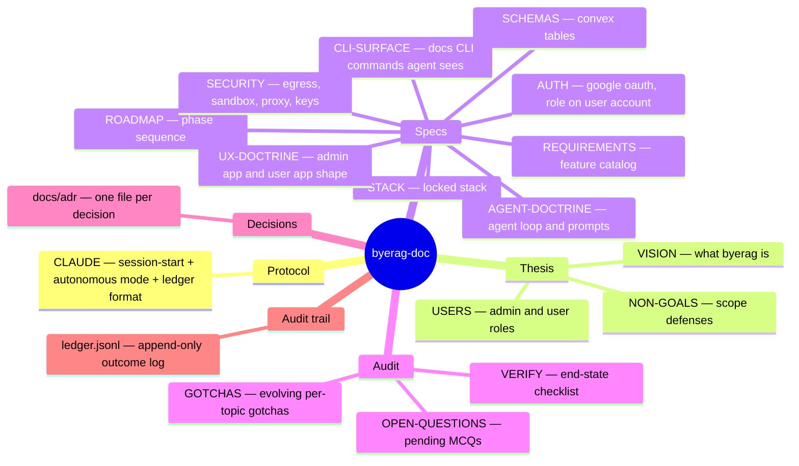

# byerag-doc

Plans + decisions + protocol for the byerag product. Code lives in a sibling repo.

Read order at session start lives in `CLAUDE.md`. Generic engineering rules inherited from `~/book/` root.
